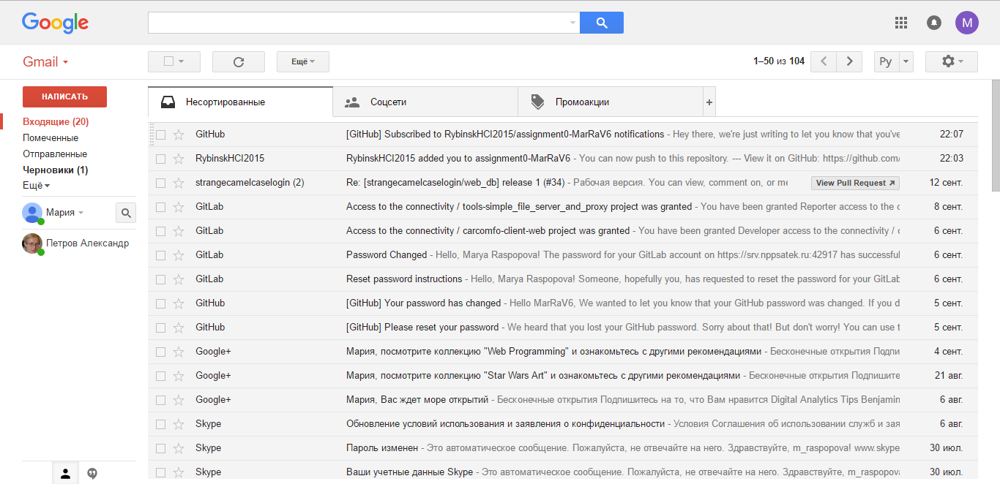
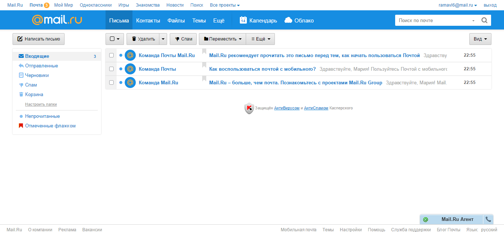

# Задание 0

Распопова Мария

* Пример хорошего интерфейса:
	Данный интерфейс не перегружен элементами, которые не относились бы никак к почте. Остальные сервисы, предлагаемые Google, спрятаны в выпадающем меню. Кнопки для работы с выделенными письмами появляются только при выделении этих самых писем. Они не отвлекают во время прочтения писем. Левое меню неширокое, из-за чего основной текст письма концентрируется на середине экрана, что делает его удобней для прочтения. Кнопка настроек спрятана в меню под "говорящим" значком. Кнопка "написать" выделена красным цветом, что не дает ей потеряться среди остальных кнопок.

* Пример плохого интерфейса
	На экране присутствуют элементы мало относящиеся к почте. Кнопка настроек скрыта под кнопкой "еще", что не делает ее поиск интуитивно понятным. Раскрыты дейтсвия над письмами такие, как "удалить", "спам", "переместить". Данные кнопки активны даже, если нет выделенного письма, что кажется немного странным. Особенно настораживает кнопка, названная "спам", так как точно такая же есть в левом меню. Отсутствие слова "отметить" на данной кнопке в какой-то мере отождествляет две данных функции. Левое меню очень широкое, из-за чего текст письма смещается с центра экрана. Кнопка "написать письмо" не выразительна и теряется на общем фоне. 

